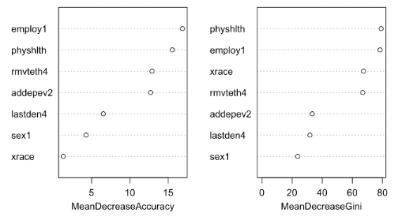

<!--This is the README for STAT288 final project with Amir Barghi-->

# The problem of class imbalance in predictive modeling as revealed by the 2018 Behavioral Risk Factor Surveillance System data for asthma in adults

## Introduction

We were interested in predicting asthma in adults based on demographic descriptors as well as variables associated with substance use and other chronic health conditions using the 2018 Behavioral Risk Factor Surveillance System (BRFSS) dataset. We wanted to determine whether a diagnosis of asthma in respondents depended on whether the respondent lived in an urban or rural area.  We also wanted to determine if tobacco use, alcohol use, or other demographic factors were associated with a diagnosis of  asthma.  Lastly, we sought to determine if other chronic health conditions in the respondent were associated with a diagnosis of asthma. We restricted our analyses to data from Illinois, Michigan, and Ohio, because these states are located within the same region of the country, consist of large metropolitan as well as rural areas, and might be more representative of the country as a whole than other states. Only predictors whose associated questions were asked in all three states were included in our study. The complete list of predictors used in our analyses is given in Table 1.

### Table 1. Predictors Initially Considered in our Analyses
The response variables in our analyses are italicized
| |coded variable | explanation |
|----------------|--------------------|-------------------------|
**Demographics** |    | |
|                | sex1  | sex |
|                | _state | state FIPS code |
|                | _race  | computed race |
|                | _metstat| metropolitan status |
|                | mscode  | metropolitan status code |
|                | _urbstat| urban/rural status |
|                | educa   | education level |
|                | employ1 |employment status |
|                | income2 |income level
|                | _age65yr/_age5yr | age |
**Chronic conditions** |  |  |
|    | cvdinfr4 |diagnosed with heart attack|
|    | cvdcrhd4 | diagnosed with angina/CAD |
|    | cvdstrk3 | diagnosed with a stroke   |
|    | chkdny1  | told have kidney disease  |
|    | *asthma3*  |  told had asthma          |
|    | *asthnow*  |    still have asthma      |
|    | *casthdx2* | told child has asthma     |
|    | *casthno2* | child still has asthma    |
|    | chccopd1 | told have COPD |
|    | havarth3 | told have arthritis |
|    | addepev2 | told have a depressive disorder |
**General health** |  |  |
|    | exerany2 |   exercise in past 30 days |
|    | sleptim1 | how much time sleeping |
|    | genhlth  | general health status |
|    | physhlth | number of days with poor physical health |
|    | menhlth  | number of days with poor mental health |
|    | poorhlth |poor physical or mental health |
|    | lastden4 |last visited dentist |
|    | rmvteth4 | number of permanent teeth removed |
**Substance use** |  |  |
|    | smoke100 |smoked at least 100 cigarettes  |
|    | smokday2 |freq. of days now smoking  |
|    | usenow3  |use of smokeless tobacco products  |
|    | lastsmk2 |interval since last smoked   |
|    | ecigaret |ever used an e-cigarette |
|    | ecignow  |now use e-cigarettes |
|    | alcday5  |days in past 30 had alcohol |
|    | avedrnk2 | avg. alcoholic drinks/day in past 30 days   |
|    | drnk3ge5 |binge drinking in past 30 days |
|    | maxdrnks |most drinks on a single occasion past 30 days   |
|    | marijan1 |how many days in past 30 used marijuana  |
|    | rsnmrjn1 |reason used marijuana|

## Variables associated with asthma in adults

Decisions about which predictors on which to base the analysis of adult asthma were made based on their relevance to asthma3, as the responses for asthnow represent a subset of the responses for asthma3. The prevalence of respondents who answered “yes” for asthma3 in the entire 2018 BRFSS data set is only 14.13% and that of respondents answering “yes” for asthnow is 9.59% of that, accounting for 67.87% of asthma3 = “yes” respondents.  Nevertheless, a large class imbalance exists among respondents regarding asthma in adults. We dropped variables associated with substance use from the analysis, because some had very low response rates and these variables did not covary with the proportions of observations with asthma3 = “yes”.  Predictors found to vary with asthma3 and asthnow by chi-squared analysis are listed in Table 2.

### Table 2. Variables associated with asthma3 and asthnow by &chi;2 analysis

| response | associated predictor |
|------------------|----------------------|
| **asthma3**      |   
|  *demographics*    |sex1, _state, _race, educa, employ1, income2, _age65yr/_age5yr||
| *chronic conditions* | cvdcrhd4, cvdstrk3, chkdny1, asthnow, casthdx2, casthno2, chccopd1, havarth3, addepev2 |
| *susbtance use*  | smoke100, smokday2, lastsmk2, ecigaret, alcday5, marijan1, rsnmrjn1|
| *general health* | exerany2, sleptim1, genhlth, physhlth, menthlth, poorhlth, lastden4, rmvteth4 | 
| **asthnow**      |                  |
|  *demographics*    |sex1, xstate, xmetstat, educa, employ1, income2, _age65yr/_ageg5yr|
| *chronic conditions* | asthma3, asthnow, casthno2, casthdx2, chccopd1, havarth3 |
| *susbtance use*  | smokday2, lastsmk2, ecignow, alcday5, avedrnk2, drnk3ge5, maxdrnks, marijan1, rsnmrjn1|
| *general health* | exerany2, sleptim1, genhlth, physhlth, menthlth, poorhlth, lastden4, rmvteth4 |

We divided the data into training and test sets of equal size and began to fit models predicting the response for asthma3 using variables from each representative category shown in Table 1. We then obtained reduced models by eliminating the predictors whose coefficients were not significant (p-value > 0.05). Typically this resulted in lower test error estimates (Table 3) but a less favorable AIC, suggesting that reduced models were more poorly describing the variability in asthma3 responses. 

### Table 3. Logistic Regression Test Error Estimates
|Predictor category| AIC |Test error| Variables in the model|
|------------------|-----|----------|-----------------------|
| **Response: asthma3**|   |   |                    |      
| chronic conditions | 681.59 |     0.1811     | full model  |
| chronic conditions reduced| 2366.2| 0.1519| havarth3, addepev2, cvdcrhd4, chccopd1, casthdx2, casthno2 |   
| demographics      | 3122.6 |     0.1435     | full model |
| demographics reduced | 10585 | 0.1433 | _race, employ1, _age5yr|
| **Response: asthnow**|   |   |                    |
| chronic conditions | 548.94 | 0.1386 | full model |
| chronic conditions reduced| 8159.5| 0.1025| chccopd1, casthno2|
| demographics | 2559.1 | 0.1024| full model |
| demographics reduced | 3014| 0.1014| sex1, _metstat, mscode, employ1|

The best test error estimates we could achieve amounted to having null models that always predicted “no” for asthma3 and asthnow. Recall that only 14.13% of survey responsdents answered "yes" to asthma3 and compare the test errror estimates shown in Table 3 with this percentage. Even when we generated synthetic data with a 50/50 mixture of respondents answering “yes” or “no” for asthma3 or asthnow, our best test error estimate was 49.68%, indicative of a null model. Efforts to enrich for “yes” responses for asthma3 or asthnow by filtering the data based on other predictors only yielded models that overfit the training data with no improvement in test error estimates.

We bypassed LDA and QDA , given that they rely on a maximum likelihood procedure similar to logistic regression, and instead asked whether classification trees would yield predictions using different predictors or with better accuracy. Classification trees produced marginally higher test error estimates than those of logistic regression models (Table 4). 

### Table 4. Classification Tree Test Error Estimates
| Response variable | Test error | Variables in tree|
|-------------------|------------|------------------|
| asthma3 | 0.1650 | physhlth, menthlth, havarth3, income2,  educa, rmvteth4, mscode, employ1, xageg5yr |
| asthma3 pruned | 0.2037| physhlth, menthlth, havarth3, educa, mscode|
| asthnow | 0.1366 | genhlth, menthlth, exerany2, income2, educa, rmvteth4, mscode, employ1,  xageg5yr |
| asthnow reduced | 0.2041| genhlth, menthlth, exerany2, income2, rmvteth4, mscode, employ1,  xageg5yr |

We employed cross validation to select simpler trees by pruning according to misclassification rate and found that pruned trees performed worse, and the lowest cross validation error rates were obtained by trees consisting of single nodes. 

The only predictors that overlapped between classification trees and logistic regression models with asthma3 as the response variable were havarth3 and employ1. No predictors were common among both trees and logistic regression models for prediction of asthnow. As they yielded similar error rates to logistic regression models but with different predictors, classification trees were likely producing null models.  Variable importance plots are shown in Table 5.

### Table 5. Variable Importance Plots for asthma3 (top) and asthnow (bottom)

To minimize the variance of the estimates produced by classification trees, we employed bagging (bootstrap aggregation). Test error estimates of our bagged models were not considerably different from test errors for individual trees (Table 6). 

### Table 6. Bagging, Boosting, and Random Forest Test Errors
| Response variable | OOB error| Test error| Response variable| Best test error|
|---------|---------|----------|----------|-----------|
|**Bagging**| | | |
|asthma3  | 0.313 | 0.1922 | casthdx2 | 0.1309 |
|asthnow  | 0.20  | 0.1216 | casthno2 | 0.0818 |
|**Boosting**| | | |
|casthdx2 | | | | 0.2956 (&lambda;=0.05, d=8)|
|casthno2 | | | | 0.0457 (&lambda;=0.01, d=4) |
|**Random Forest**| | | |
|asthma3 | 0.199 | 0.1531| | |
|asthnow | 0.1004| 0.1162| | |

We employed random forests by using a subset of predictors for each aggregated tree, retaining predictors that had the greatest effect on accuracy or the Gini index based on visual inspection of the R output. This reduced test errors relative to bagging but was no better than logistic regression.  

## Summary

Our results demonstrate the pitfalls of severe class imbalances a the response variable.  None of our test error estimates suggests that any of our models performed better than a null model that would always predict “no” for a diagnosis of asthma, for such a model would only be incorrect 14.13% of the time.  Nevertheless, all models assigned statistically significant coefficient estimates to predictors found to covary with asthma3 or asthnow by chi-squared analysis.  Perhaps other predictors are required for the development of more accurate models for the prediction of asthma, such as those pertaining to air quality, including measures of air pollution and allergens, or whether the respondent’s asthma is exercise induced.  The relationship between arthritis and asthma has been pointed out by medical researchers1, suggesting that a more detailed stratification of asthma patients may be needed.

## References

1. Rolfes, M.C, Jun Huh, Y., Wi, C.I., and Sheen, Y.H., Asthma and the Risk of Rheumatoid Arthritis: An Insight into the Heterogeneity and Phenotypes of Asthma, Tuberc Respir Dis (Seoul). 2017 Apr; 80(2): 113–135.

